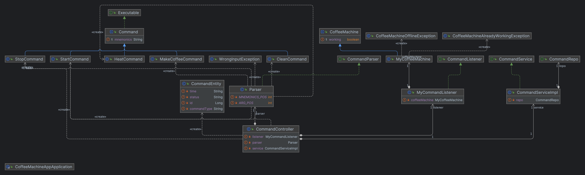

    AISA Testing task

  
Table of Contents

  <ol>
    <li><a href="#task">Task</a></li>
    <li><a href="#description">Descriprion</a></li>
    <li><a href="#uml">UML</a></li>
  </ol>

## Task
Write a program to operate the coffee machine and control it through a browser.
Use SpringFramework or SpringBoot.
Keep records of work in PostgesSQL.
No interface needed, requests via SwaggerUI.

## Description
In project used comand pattern. Swagger-UI appears as a user interface and @RestController
is a receiver. Abstract command is used to generate new types of commands as new child
classes. There is a command listener which evokes command's execute method and provides
it with coffee machine class.

## UML

